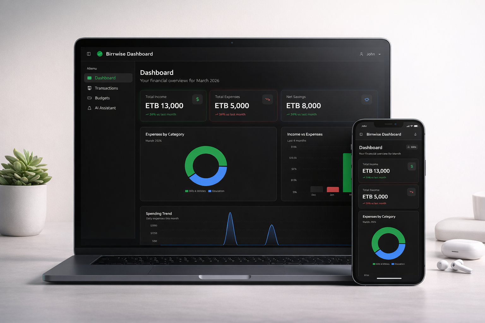

<p align="center">
	
</p>

<h1 align="center">BirrWise</h1>

<p align="center">
	Full-stack personal finance platform for budgeting, transactions, analytics, and AI-assisted money insights.
</p>

<p align="center">
	<a href="#"></a>
	<a href="#"></a>
	<a href="#"></a>
	<a href="#"></a>
	<a href="#"></a>
	<a href="#"></a>
	<a href="#"></a>
	<a href="#"></a>
	<a href="#"></a>
</p>



## Table of Contents

- [Overview](#overview)
- [Features](#features)
- [Tech Stack](#tech-stack)
- [Architecture](#architecture)
- [Getting Started](#getting-started)
- [Configuration](#configuration)
- [Running the Apps](#running-the-apps)
- [API Endpoints](#api-endpoints)
- [Folder Structure](#folder-structure)
- [Available Scripts](#available-scripts)
- [Contributing](#contributing)
- [License](#license)

## Overview

BirrWise helps users take control of personal finances with an integrated dashboard and AI chat experience.

- Track and categorize transactions
- Set and monitor monthly budgets
- Review spending trends and summary analytics
- Ask finance questions through an AI assistant (optional via Gemini)

## Features

- Secure authentication with access and refresh token flow
- Budget management with validation and update support
- Transaction CRUD with category-aware tracking
- Dashboard analytics (summary, category, monthly, and daily insights)
- Optional AI assistant endpoint for contextual personal-finance guidance
- Clean, responsive React UI built with Tailwind + shadcn/ui + Radix components

## Tech Stack

### Frontend

- React 18
- TypeScript 5
- Vite 5
- Tailwind CSS
- shadcn/ui + Radix UI
- React Query, React Hook Form, Recharts, Zustand

### Backend

- Node.js + Express 4
- TypeScript
- MongoDB with Mongoose
- Zod request validation
- JWT authentication

### Tooling

- ESLint
- Vitest
- Bun or npm for frontend workflow

## Architecture

- `client/` is a SPA that consumes REST APIs from `server/`.
- `server/` exposes API modules for auth, budgets, transactions, dashboard, and AI chat.
- Protected endpoints use JWT middleware.
- MongoDB stores users, transactions, budgets, refresh tokens, and AI history metadata.

## Getting Started

### Prerequisites

- Node.js 20+
- npm 10+ (or Bun for client scripts)
- MongoDB instance (local or hosted)

### 1. Clone

```bash
git clone <repo-url>
cd AI-Powered-personal-finance
```

### 2. Install Dependencies

```bash
cd server && npm install
cd ../client && npm install
```

## Configuration

Create local environment files from the checked-in examples before running the apps.

```bash
cp server/.env.example server/.env
cp client/.env.example client/.env
```

If any credential was ever committed to git, treat it as compromised. Rotate it in the provider dashboard first, then update your local `.env` with the replacement value. Removing the file from the repo does not invalidate an exposed secret.

### Backend (`server/.env`)

```env
PORT=4000
MONGODB_URI=mongodb://localhost:27017/savvy_finance
JWT_SECRET=replace_with_strong_secret
JWT_EXPIRES_IN=1h
JWT_ISSUER=savvy-finance-hub
JWT_AUDIENCE=savvy-finance-hub-client
REFRESH_TOKEN_SECRET=replace_with_refresh_secret
REFRESH_TOKEN_EXPIRES_IN=7d
CORS_ORIGIN=http://localhost:5173
AI_ENABLED=false
GOOGLE_API_KEY=
GEMINI_MODEL=gemini-2.5-flash
```

### Frontend (`client/.env`)

```env
VITE_API_BASE_URL=http://localhost:4000/api
```

### Secret Exposure Response

If a secret was exposed in repository history:

1. Rotate the credential at the provider immediately.
2. Update your local `server/.env` with the new value.
3. Remove tracked env files from git and commit that cleanup.
4. Decide separately whether you also need a history rewrite for compliance.

```bash
git rm --cached server/.env client/.env
git commit -m "chore: stop tracking local env files"
```

## Running the Apps

Run each app in its own terminal.

### Backend

```bash
cd server
npm run dev
```

### Frontend

```bash
cd client
npm run dev
```

## API Endpoints

### Auth (`/api/auth`)

- `POST /register`
- `POST /login`
- `POST /refresh`
- `POST /logout`
- `GET /me`

### Budgets (`/api/budgets`)

- `GET /`
- `PUT /:id`

### Transactions (`/api/transactions`)

- `GET /`
- `POST /`
- `PUT /:id`
- `DELETE /:id`

### Dashboard (`/api/dashboard`)

- `GET /summary`
- `GET /category-expenses`
- `GET /monthly`
- `GET /daily-expenses`

### AI (`/api/ai`)

- `POST /chat` (requires `AI_ENABLED=true` and `GOOGLE_API_KEY`)

## Folder Structure

```text
AI-Powered-personal-finance/
|-- client/
|   |-- public/
|   |-- src/
|   |   |-- components/
|   |   |-- pages/
|   |   |-- services/
|   |   |-- store/
|   |   `-- utils/
|   `-- package.json
|-- server/
|   |-- src/
|   |   |-- config/
|   |   |-- controllers/
|   |   |-- middleware/
|   |   |-- models/
|   |   |-- routes/
|   |   |-- schemas/
|   |   |-- services/
|   |   `-- utils/
|   `-- package.json
`-- README.md
```

## Available Scripts

### Client

- `npm run dev`
- `npm run build`
- `npm run preview`
- `npm run lint`
- `npm run test`

### Server

- `npm run dev`
- `npm run seed`
- `npm run build`
- `npm run start`

## Contributing

1. Fork the repository.
2. Create a feature branch.
3. Commit your changes with clear messages.
4. Open a pull request with context and test notes.

## License

MIT
